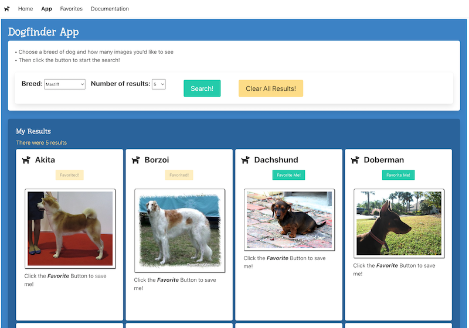

# Project 1 - VanillaJS App of Awesomeness
## *Checkpoint #2 - Working Prototype*

## Project 1 Links:

- [Project 1 - Checkpoint #1](p1-checkpoint-1.md)
- **Project 1 - Checkpoint #2**
- [Project 1 - Final Deliverable](p1-final.md)
- [Project 1 - Tips & Tricks](p1-tips.md)
- [IGME-330 - Course Code Style Requirements](330-code-style.md) 

## I. Checkpoint Rubric First
- Worth 5% of Final Course Grade
- Out of 25 points

    A. (2 points) - [Home Page](#ii-content-requirements---home-page) has required content
    
    B. (8 points) - [App Page](#iii-functional-requirements---app-page) requirements are met

    C. (5 points) - [Favorites Page](#iv-functional-requirements---favorites-page) requirements are met
    
    D. (3 points) - [Documentation Page](#v-content-requirements---aboutdocumentation-page) has required content
    
    E. (2 points) - Bulma is utilized for navigation, text, buttons App UI etc throughout all 4 pages of the site
    
    F. (2 points) - App page UI state and app favorites are preserved in `localStorage` inside a single object literal. The `localStorage` key (there is only one) is uniquely named as required below

    G. (1 point) - There is "mobile friendly" navigation with a functioning hamburger menu on all pages

    H. (1 point) - The app now utilizes 3 distinct web components (the "card" component from the App page, and the 2 web components from checkpoint #1)

    I. (1 point) - Follows [IGME-330 - Course Code Style Requirements](./330-code-style.md)
    
    J. (***Deductions***) - points will be deducted for P1 - [Checkpoint #1 requirements](p1-checkpoint-1.md) that are still not met

## II. Content Requirements - *Home page*

1. Tell the user what your app does
    - Have some sort of "brand" for your page:
      - it could be a `navbar-brand` like in the Bulma template - an image or font awesome icon
      - it could be a stylized logo you create yourself
    - You might want to use a Bulma `hero`
2. There must be at least one image on this page (in addition to whatever appears in `navbar-brand`)
3. *Optional: Consider adding some sort interactive content or "flare" to this page - an image carousel, random quotes from happy users, etc*

## III. Functional Requirements - *App page*

1. The app WILL utilize at least **ONE** web service API (or approved data source)

2. The app WILL provide the user (minimally) with the following 3 controls

    - a button for searching
    - an `<input type="text">` they can type a search term into
    - you will also provide one other control for the user - for example - to filter or limit the number of results. It could be a `<select>` (which is a pulldown menu) or a `<input type="number">` (which is a number "stepper") that is used to set such a limit
    - *optionally*, you could have even more controls on this page - radio buttons, checkboxes, sliders etc - whatever makes the app more useful for the end user

3. The above controls ARE ALL styled by Bulma classes - https://bulma.io/documentation/form/general/

4. Functionality: when the use clicks the button, results WILL be downloaded and then displayed on the screen

5. These results WILL be displayed using a custom "card" component that was created by you
    - refer to [HW - Web Components-3](https://github.com/tonethar/IGME-330-Master/blob/master/notes/HW-wc-3.md) and the `<sw-card>` component as an example

6. Every time the user clicks the search button, this App page WILL automatically save the last term searched by the user and the third control's UI *state* in the browser's `localStorage` - this was covered in IGME-230/235 here --> [Web Apps 9 - WebStorage API](https://github.com/tonethar/IGME-230-Master/blob/master/notes/web-apps-9.md):
    - we are going to test this capability by typing in a search term, changing a value of the 3rd control, doing a search, and then closing the browser window. When we re-open the window, the user's last search term must be visible, and the rest of the UI should be in the same *state*
    - you will store this app state in an *object literal* under a single "key" named `abc1234-p1-settings` (where `abc1234` is your "banjo id")
    - storing object literals in `localStorage` is covered here - [Web Apps 9 - WebStorage API - Storing Objects with Web Storage](https://github.com/tonethar/IGME-230-Master/blob/master/notes/web-apps-9.md#iii-storing-objects-with-web-storage)

7. There WILL be a "Favorites" button that adds individual search results to the *Favorites page* - see below

## IV. Functional Requirements - *Favorites page*

1. The favorites (or lists or bookmarks) WILL be stored in `localStorage` 
    - in the same object literal
    - and under the same `abc1234-p1-settings` "key" referenced above

2. These favorites WILL automatically appear on the page when the user first loads it

3. There MUST be a be a *Delete* button that clears `localStorage` (thus removing the favorites from the page)

4. *Optional* - if there are a lot of favorites, the user will probably be able to interact with them in some other way - "View Next 5" and "View Previous 5" buttons

5. *Optional* - the user can also sort, re-order and delete individual favorites

## V. Content Requirements - *About/Documentation page* 
- Keep your project proposal from checkpoint #1 - and put it under a PROPOSAL subheading
- Have the following additional 6 sub-headings on your page (see the [example Desktop screenshots of sources.html](#desktop-sources-screenshots) below
  - PROJECT REQUIREMENTS:
    - provide a link to this page
  - RESOURCES UTILIZED:
    - cite any and all resources you used on this project, the specific link, including:
      - fonts and images
      - reference sites - ex. developer.mozilla.org
      - "help" sites - ex. stackoverflow.com
      - code snippet sites - ex. CodePen or gists.github.com or copying starter code from the Bulma site etc
      - tutorial sites - ex. w3schools.com
      - video sites - ex. YouTube or LinkedIn Learning or Udemy
      - blog postings etc
    - Exception: you need not cite any IGME-330 resources/tutorials/HWs:
      - but you MUST cite resources from other courses including IGME-235 
  - API:
    - Link to the API Home, documentation, and endpoints used (but don't include your API key!)
  - NOTEWORTHY: (you can leave this section blank for now)
    - Talk the project up - list the technologies you used (web components, Bulma, fetch, promises, etc)
    - Be sure to emphasize what you did outside of what we covered in class
  - GRADING: (you can leave this section blank for now - ***Required with Final Submission only***)
    - Describe how you met project requirements
    - Describe how you went "above and beyond" project requirements
    - In the comments field of the dropbox, grade your Project 1 submission
  - TO DO:  (you can leave this section blank for now - ***Required with Final Submission only***)
    - List any features that you would have liked to add if you had time
    - These could potentially be added to the app for Project 2, or over break/summer when you have time

## VI. Sample Screenshots

<a id="desktop-screenshots"/>

### VI-A. Desktop Version

**about.html**

**app.html**

**favorites.html**

**sources.html**

### VI-B. Mobile Version

**about.html**

**app.html**

**favorites.html**

**sources.html**

## VII. Resources
- [GIF Finder](https://github.com/tonethar/IGME-230-Master/blob/master/notes/HW-gif-finder.md) might be some helpful review on how `XHR` works, and how to pass query parameters to a web service

## VIII. Think ahead to the final project deliverable ...
- ... and get started on these requirements as soon as you can!
- The app must have a 4th web component - `<app-navbar>`
- The app must use `fetch()` instead of `XHR`
- The app must use either Mapbox or Firebase
- The app must be easy to use, with well-labeled and obvious controls:
  - the search button is prominent, in an obvious location, stands out from the rest of the UI (give it an appropriate Bulma style for a seach button) and "looks like a button"
  - controls can have labels and/or tooltips (use the `title` attribute)
- The app must always "let the user know what's going on" with activity indicators
  - use the `is-loading` Bulma class to get a "spinner" on a button - https://bulma.io/documentation/elements/button/
  - use a Bulma "Indeterminate Progress Bar" - https://bulma.io/documentation/elements/progress/#indeterminate
- The app must "fail gracefully" and errors must be communicated to the user - for example:
  - "No results found" message if a search comes back with no results
  - "Please enter a search term" if the user clicks the search button without typing anything in
- The app must have "Impact":
  - it serves a purpose - i.e it should be useful to someone
  - it is easy to use, functional, and aesthetically pleasing
  - it should be (or approaching) "portfolio quality" - something you would be able to show a potential employer

<!--
## II. Project 1 Final 
- Worth 15% of Final Grade 

    A. The Favorites Page now functions - it will use localStorage to storage user specific app favorites locally. All of the app favorites are preserved in localStorage inside of the single object literal used in Project 1 Checkpoint. The favorites will be displayed using a custom web component

    B) The App will utilize Firebase to create a Community page

    **OR**

- The App will utilize Mapbox and display location data that is returned by a web service. The app will not solely display hard-coded (or locally stored) location data

    C) App navigation now has "You are here cues" (ex. **bold** text or a different colored background, NOT literally the words "You Are Here")
    
    D) App navigation is now a web component

    E) App Page Improvements:

    1. animated button or element letting the user know when a search is going on

    F) Design & Interaction 

    1. Pleasing graphic design
    1. Users must be able to figure out how to use the app with minimal instruction
      - be sure to provide instruction and tooltips if necessary
    1. User errors must be handled gracefully
      - for example, if the user forgets to type in a search term before clicking the Search button, the app should tell the user something like "Please enter a search term first"
    1. Users must know what *state* the app is in at all times

-->

<!--
## ***Fall 2021 Reference***

- https://github.com/tonethar/IGME-330-Fall-2021/blob/main/projects/project-1.md
- https://github.com/tonethar/IGME-330-Fall-2021/blob/main/projects/project-2.md
- https://github.com/tonethar/IGME-330-Fall-2021/blob/main/projects/p1-tips.md
-->
