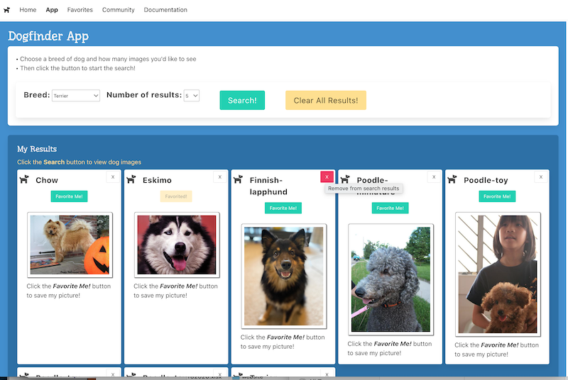
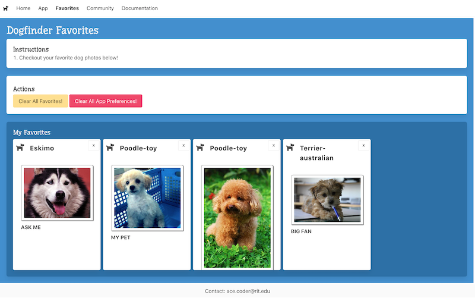

# Project 1 - HTML5 App of Awesomeness
## Final Deliverable

## Project 1 Links:

- [Project 1 - Checkpoint #1](p1-checkpoint-1.md)
- [Project 1 - Checkpoint #2](p1-checkpoint-2.md)
- **Project 1 - Final Deliverable**
- [Project 1 - Tips & Tricks](p1-tips.md)
- [IGME-330 - Course Code Style Requirements](330-code-style.md) 

## I. Requirements

1) Everything from the prevous checkpoints is still required - 4 pages (and probably one more for this version if you are using Firebase), global navigations system, uses Bulma, uses a web service or data source and so on.

2) Every time the user clicks the search button, this App page WILL automatically save the last term searched by the user and the third control's UI *state* in the browser's `localStorage` - this was covered in IGME-230/235 here --> [Web Apps 9 - WebStorage API](https://github.com/tonethar/IGME-230-Master/blob/master/notes/web-apps-9.md):
    - we are going to test this capability by typing in a search term, changing a value of the 3rd control, doing a search, and then closing the browser window. When we re-open the window, the user's last search term must be visible, and the rest of the UI should be in the same *state*
    - you will store this app state in an *object literal* under a single "key" named `abc1234-p1-settings` (where `abc1234` is your "banjo id")
    - storing object literals in `localStorage` is covered here - [Web Apps 9 - WebStorage API - Storing Objects with Web Storage](https://github.com/tonethar/IGME-230-Master/blob/master/notes/web-apps-9.md#iii-storing-objects-with-web-storage)
    - we also covered it in the [Week 6A `localStorage` demo](../weekly/06A.md#iv-localstorage-demo)

3) The app must have a 4th web component - and it must be `<app-navbar>` - this navbar must have "you are here" cues such as bold text

4) The app must use `fetch()` instead of `XHR`

5) The app must use either Mapbox or Firebase:
  - If you are using Mapbox, you probably should NOT do a full-screen interface like we did in the Maps II HW. Much of the time, a smaller map, and displaying more textual information, makes sense. For example, see how Yelp handles maps - https://www.yelp.com/search?find_desc=Garbage+Plate&find_loc=Rochester%2C+NY+14604
    - you MUST have markers in the map - these will likely show a user's search results
    - the markers MUST be clickable and display useful information
    - there MUST be map controls for the user
    - new searches will probably wipe out "old" markers from previous searches
    - if you want to add layers to your map, see the [Mapbox-III - Virus Map extra credit assignment](https://github.com/tonethar/IGME-330-Master/blob/master/notes/HW-mapbox-3.md)
  - If you are using Firebase, you will probably be meeting that requirement with a **"Community"** page, which shows the favorites of ALL of the app's users
    - We are covering Firebase on 7B and 8A
    - You must to save (WRITE) some sort of web site data to "the cloud" using Firebase (typed in user search terms, favorited Pokemon, etc):
      - [2 - Firebase Highscore App](https://github.com/tonethar/IGME-330-Master/blob/master/notes/firebase-2.md) covers how to save data to the cloud using Firebase
    - You must add a **community.html** page or similar that will display (READ) at least some of this data to your users
      - [3 - Firebase Highscore Viewer](https://github.com/tonethar/IGME-330-Master/blob/master/notes/firebase-3.md) covers how to read data from the cloud using Firebase
    - Important Note: 
      - Individual data - a user's favorites and other user data (such as the last term searched by that user and other UI state) MUST still be stored in the browser's local storage and displayed on your **favorites.html** page
      - **community.html** will shows favorites (or other data) for ALL of the users

6) The app must be easy to use, with well-labeled and obvious controls:
    - the search button is prominent, in an obvious location, stands out from the rest of the UI (give it an appropriate Bulma style for a seach button) and "looks like a button"
    - controls should have labels and/or tooltips (use the `title` attribute)

7) The app must always "let the user know what's going on" with activity indicators:
    - use the `is-loading` Bulma class to get a "spinner" on a button - https://bulma.io/documentation/elements/button/
    - use a Bulma "Indeterminate Progress Bar" - https://bulma.io/documentation/elements/progress/#indeterminate
    - if a search result on a card is *favorited*, then the "Favorite Me!" button should change state to indicate that particular result cannot be favorited again

8) The app must "fail gracefully" and errors must be communicated to the user - for example:
    - "No results found" message if a search comes back with no results
    - "Please enter a search term" if the user clicks the search button without typing anything in

9) The app must have "Impact":
    - it serves a purpose - i.e it should be useful to someone
    - it is easy to use, functional, and aesthetically pleasing
    - it should be (or approaching) "portfolio quality" - something you would be able to show a potential employer

## II. Code Standards
- All project files MUST adhere to this --> [IGME-330 - Course Code Style Requirements](330-code-style.md) 
- All `<script>` tags MUST be in the `<head>` section of the document and be of `type="module"`
- All web components are in their own JS file. Component file names MUST match their tag name - example - the file that contains the `<sw-card>` code must be named **sw-card.js**
- All web components must accept at least 1 *parameter* and utilize it. A parameter can be passed in via slots, attributes or via an object property
- Simplify the code in your web components and eleminate any redudant code:
  - for example, if you are just using slots and there's no JavaScript in the component, you probably don't need any of the lifecycle methods, nor do you even need a `render ()` helper method. The `template` and a `constructor()` should suffice
- All HTML pages must pass HTML validation - this includes your web components too
  - be sure to test your **app.html** page AFTER you've loaded in some results and instantiated - for example - some `<sw-card>` component instances 
  - https://validator.w3.org/
- All CSS must pass CSS validation
  - https://jigsaw.w3.org/css-validator/

## III. Demo Video

- A 1 to 2-minute narrated demo video of the completed project is required
- You can post it to YouTube & put the URL in the dropbox comments field
- If you decide to upload a video file instead, it must be in the MP4 format
- The easiest way to record a demo video is to use Zoom - here is a 2-minute video on how to do this: https://www.youtube.com/watch?v=D617OXKhSYw
  - another popular option for creating videos is [OBS](https://obsproject.com/download)
  - don't forget to "Share Screen" so that I can see you interacting with the project
  - don't forget to record your narration too, and be sure to use a better microphone than the one that came with your laptop `:-)`
- Please don't stress out over this requirement - I am the only one who will see the video - I won't be sharing or posting these
- **10% deducted from project 1 grade if this video requirement is not completed**

## IV. Screenshots

**App Page**

**Favorites Page**

**Community Page**

- Note the limit of 10 community favorites being displayed at once - you will probably want to do something similar

## IV. Rubric (DRAFT - still needs tweaking/simplification)

- Note: All requirements from previous checkpoints are still in effect, and you will lose points for not meeting them

Your project will be graded on the following criteria:

| Criteria | Weight | Your Score |
| -------- | ------ | ---------- |
| **A. Functionality - App & Favorites Pages** | **40** | |
|    1. App Page implements all required functional requirements
|    2. App Page saves/restores last search term and other UI *state*   | |
|    3. App Page has required controls | |
|    4. Favorites Page uses local storage to display favorites  | |
|    5. Favorites Page has required "Delete Button"  | |
|    - *Web Service does not work (App Page)* | *(-30)* |
|    - *Does not save/restore UI state (App Page)  | *(-10)* |
|    - *Missing required # of controls (App Page)* | *(-10 each)* |
|    - *Favorites not stored in localstorage (Favorites Page)* | *(-15)* |
|    - *Missing Favorites "Delete" button (Favorites Page)* | *(-5)* |
| **B. Content - Home & Documentation Pages** | **10** | |
|    1. Required content is present on Home & Documentation Pages | |
| **C. Design & Interaction** | **20** | |
|    1. Global Navigation System with "you are here" cues: | |
|    2. Pleasing graphic design (embedded font, Bulma, mobile friendly) | |
|    3. Widgets are well labeled and follow interface conventions | |
|    4. User errors must be handled gracefully | |
|    5. Users must be able to figure out how to use the app with minimal instruction | |
|    6. The *state* the application is in is obvious | |
|    - *Missing "state" cues like status text or "spinners"* | *(-5)* |
|    - *Missing embedded font* | *(-5)* |
|    - *Bulma not used or utilized ineffectively* | *(-20/-?)* |
|    - *Interface looks "amateurish"  or like GIF Finder HW* | *(up to -15)* |
|    - *Widgets NOT well labeled/do not follow interface conventions* | *(-?)* |
|    - *User errors NOT handled gracefully* | *(-?)* |
|    - *App NOT intuitive to use* | *(-?)* |
|    - *App state NOT obvious* | *(-?)* |
| **D. HTML/CSS/Media**  | **10** | |
|    1. Valid HTML | |
|    2. Valid CSS | |
|    3. Images properly optimized | |
|    - *Fails HTML Validation* | *(-5)* |
|    - *Fails CSS Validation* | *(-5)* |
|    - *Most CSS is NOT in an external stylesheet* | *(-5)* |
|    - *Images larger than 100KB* | *(-2 each)* |
| **E. Code**  | | |
|    - *ES6 Module pattern not used* | *(-20)* |
|    - *`fetch()` not used* | *(-20)* |
|    - *Code Conventions NOT followed* | *(-1 to -5 per incident)* |
|    - *Code shows errors in console* | *(-5 per incident)* |
|    - *App does not function on banjo and/or locally* | *(-10 to ?)* |
|    - *App has fewer than 3 web components* | *(-5 each)* |
|    - *Web component NOT in its own JS file* | *(-5)* |
| **F. Impact**  | **20** | |
|    - If the app meets the requirements above, we will award a 10% in this category, which means the base overall grade is 90% | |
|    - *App functionality and programming goes beyond what we did in class* | *(+1 to +10)* |
|    - *App UI design goes beyond what we did in class* | *(+1 to +10)* |
|    - *App is "portfolio quality" (or nearly so)* | *(+1 to +10)* |
| **Maximum Possible Total Points** | **100** | |
| **Deductions** | **&darr; Don't lose points for any of these! &darr;** | |
| *Deduction if working version is not submitted to the Project 1 Final dropbox on time* | *(-10)* | |
| *Deduction if video is not submitted to dropbox* | *(-10)* | |
